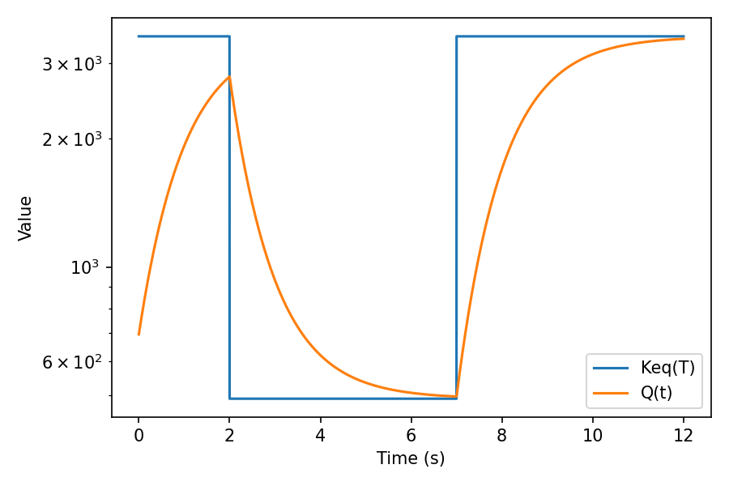

# T-Jump Relaxation

A tiny, teachable example of **log-space relaxation** when the equilibrium constant changes in time (via a temperature jump).

- **Core ODE:** \( \displaystyle \frac{d}{dt}\ln Q = -k[\,\ln Q - \ln K_{eq}(T)\,] \)
- **Thermo link (van ’t Hoff):** \( \displaystyle \ln K_{eq}(T)= -\frac{\Delta H}{RT} + \frac{\Delta S}{R} \)

This shows how kinetics (**`k`**) and thermodynamics (**`K_eq(T)`**) separate cleanly: a step in temperature changes `K_eq`; `Q` relaxes toward it exponentially in **log space**.

---

## Run it

```bash
python t_jump.py
```

What you get:

- **`t_jump.png`** — plot of `Q(t)` and `K_eq(T(t))` (semilogy).
- A line printed with the **half-time** `ln(2)/k`.



---

## What to look for

- After each temperature step, the **deviation**
  \[
  \delta(t) \equiv \ln Q(t) - \ln K_{eq}(T(t)) = \ln\!\left(\frac{Q}{K_{eq}}\right)
  \]
  decays exponentially: \(\delta(t) = \delta(t_0)\,e^{-k(t-t_0)}\).
- On a **semi-log plot of \(|\delta(t)|\) vs. `t`** you get a straight line with slope `-k`.
- This lets you **estimate `k`** directly from a T-jump trace.

---

## Parameters (edit in `t_jump.py`)

- `k` *(s⁻¹)* — single relaxation rate (default `1.0`).
- `ΔH`, `ΔS` — set the temperature-dependence of `K_eq(T)` via van ’t Hoff.
- `T(t)` schedule — simple piecewise constant profile:
  - default: **298 K → 330 K at `t = 2 s` → back to 298 K at `t = 7 s`**.
  - change the times/levels to create bigger/smaller jumps or multiple steps.

---

## Quick `k` extraction (optional)

After a step at `t0`, compute `δ(t) = ln Q − ln K_eq` over that window and fit:
\[
\ln|\delta(t)| = \underbrace{\ln|\delta(t_0)|}_{\text{intercept}} - k\,(t-t_0)
\]

Minimal snippet (drop into the script if you want):
```python
# choose an interval after the step, e.g., 2.0s <= t < 7.0s
mask = (t >= 2.0) & (t < 7.0)
y = np.log(np.abs(lnQ[mask] - lnKeq[mask]))
m, b = np.polyfit(t[mask] - t[mask][0], y, 1)
k_est = -m
print("Estimated k from fit:", k_est, "s^-1")
```

---

## Why this example is useful

- **Small & focused:** one ODE, one figure, one parameter to learn.
- **Bridges theory ↔️ practice:** classic T-jump kinetics, but equally valid for any **moving setpoint** `K_eq(t)`.
- **Composable:** swap the step for a ramp or sinusoid to show frequency response or tracking.

---

## Requirements

- Python 3.8+
- `numpy`, `matplotlib`

```bash
pip install numpy matplotlib
```

---

## Files

```
t_jump_relaxation/
  README.md
  t_jump.py
  t_jump.png   # created on run
```
